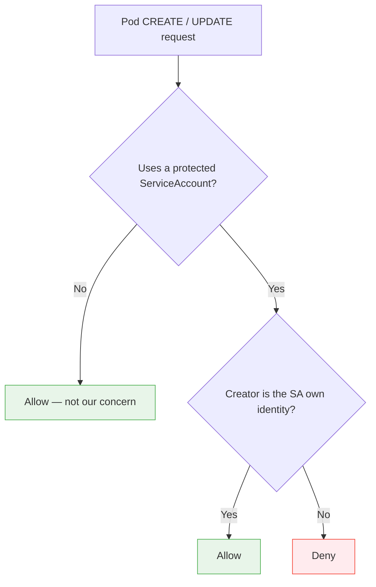
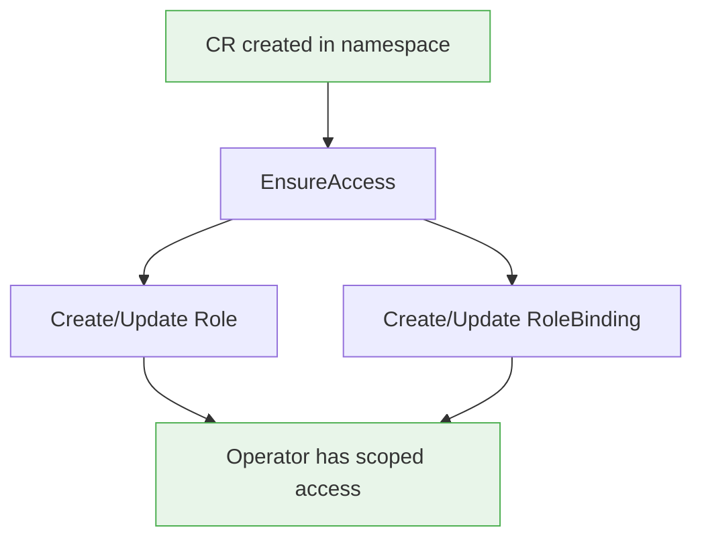
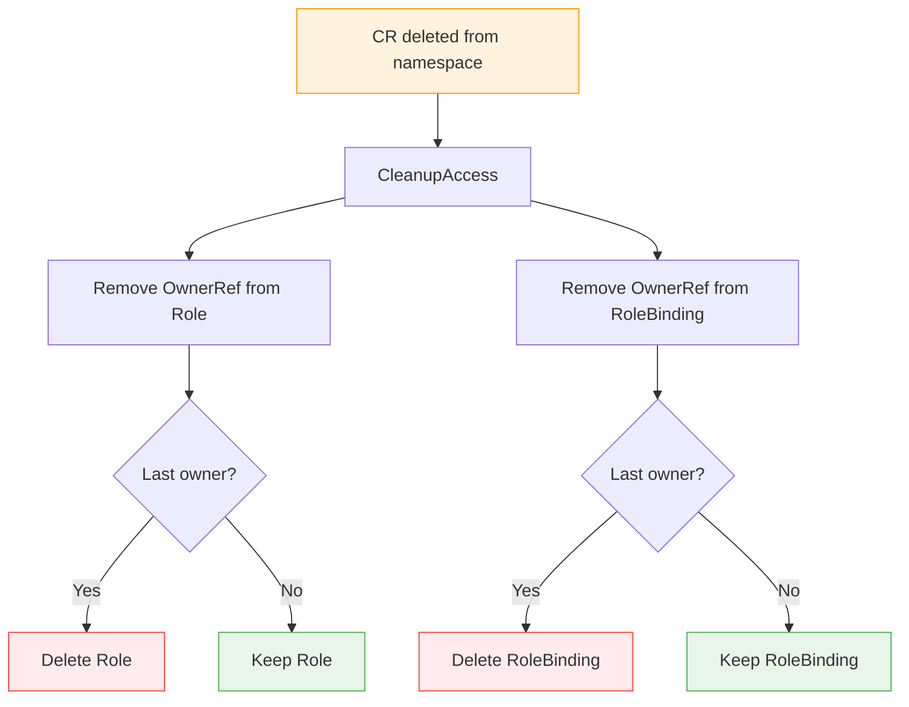
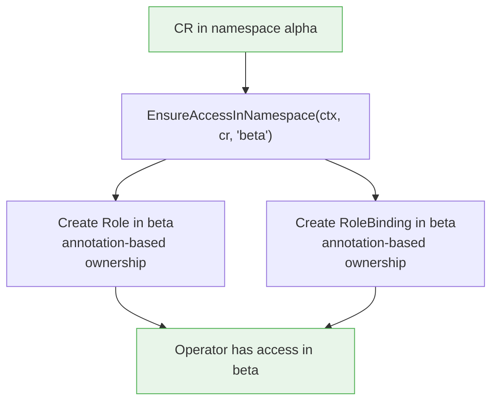
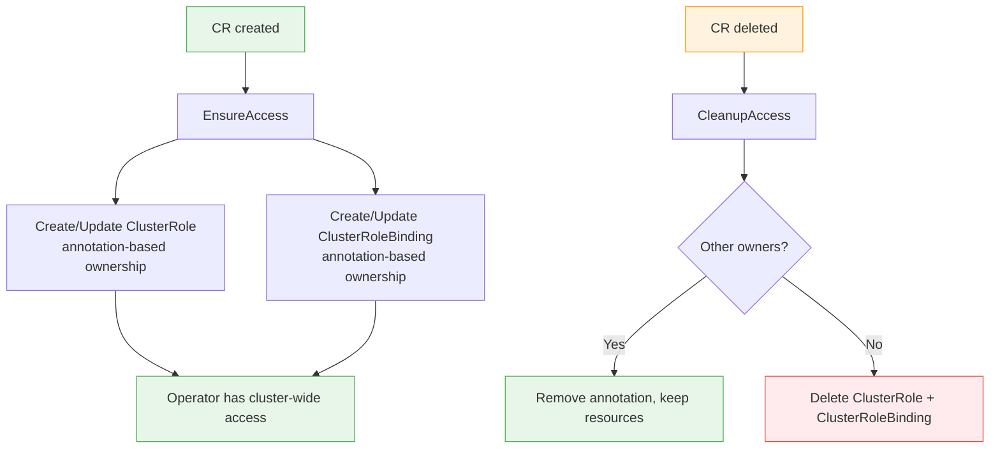
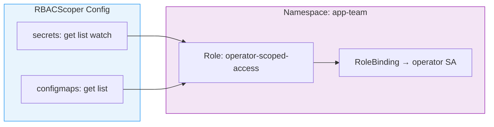

# operator-security-runtime

A Go library providing defense-in-depth mechanisms for hardening Kubernetes
operator ServiceAccounts: **SA Identity Protection** (ValidatingWebhook),
**Dynamic RBAC Scoping** (namespace-scoped Roles/RoleBindings and cluster-scoped
ClusterRoles/ClusterRoleBindings tied to CR lifecycle), **Impersonation Guard** (reconciler that strips the `impersonate`
verb from `system:aggregate-to-edit`), and **RBAC Audit** (startup scan for
impersonation and token-request exposure). All packages are independently
usable and can be integrated into any controller-runtime based operator without
requiring changes to existing reconciliation logic.

## Installation

```bash
go get github.com/opendatahub-io/operator-security-runtime
```

## How It Works

Independent mechanisms that address complementary gaps:

| | **SA Identity Protection** | **Dynamic RBAC Scoping** | **Impersonation Guard** |
|---|---|---|---|
| **Package** | `pkg/saprotection` | `pkg/rbacscope` | `pkg/impersonationguard` |
| **Controls** | **WHO** can use the operator's identity | **WHERE** the operator has permissions | **HOW** identity can be assumed |
| **Answer** | Only the operator itself | Only namespaces with active CRs | Only explicitly authorized users |
| **Mechanism** | ValidatingWebhook on Pod CREATE/UPDATE | Namespace/cluster-scoped Role/RoleBinding tied to CR lifecycle | Reconciler strips impersonate from system:aggregate-to-edit |

> **Together:** unauthorized users can't use the SA, the SA's permissions
> are limited to namespaces where work is happening, and the impersonation
> bypass is closed.

## Packages

### `pkg/saprotection`

ValidatingWebhook that prevents unauthorized usage of operator ServiceAccounts
in pod specs. When a pod is created or updated with a `serviceAccountName`
matching a protected SA, the webhook checks whether the requesting identity
(user or ServiceAccount) is explicitly authorized. Only the operator's own
identity can create pods referencing protected SAs. All other requests are
denied, blocking privilege-escalation attacks where a user with `edit`
permissions creates a pod running under the operator's highly-privileged SA.



### `pkg/rbacscope`

Dynamic RBAC scoping that creates Roles, RoleBindings, ClusterRoles, and
ClusterRoleBindings tied to CR lifecycle. `RBACScoper` manages namespace-scoped
access: same-namespace grants use OwnerReferences, cross-namespace grants use
annotation-based ownership. `ClusterRBACScoper` manages cluster-scoped access
via ClusterRoles and ClusterRoleBindings with annotation-based ownership. When
a CR is deleted (typically via a finalizer), both scopers revoke access. The
scopers support any combination of API groups, resources, and verbs via
Kubernetes-native `rbacv1.PolicyRule` structs.





**Cross-namespace scoping** -- `EnsureAccessInNamespace` grants access in a
target namespace different from the owner's, using annotation-based ownership:



**Cluster-scoped access** -- `ClusterRBACScoper` manages ClusterRoles and
ClusterRoleBindings for resources that require cluster-wide access (e.g.,
nodes, namespaces):



**Multi-resource scoping** -- a single `RBACScoper` manages one Role per
namespace containing all configured `PolicyRules`:



### `pkg/impersonationguard`

Reconciler that hardens Kubernetes RBAC by continuously stripping the
`impersonate` verb from the `system:aggregate-to-edit` ClusterRole. By default,
this ClusterRole grants `impersonate` on `serviceaccounts`, which aggregates
into `edit` and `admin` roles -- allowing any namespace editor to impersonate
any ServiceAccount. This bypasses the SA protection webhook entirely because
impersonation is processed at the Kubernetes authentication layer, before
admission webhooks fire.

The reconciler sets `rbac.authorization.kubernetes.io/autoupdate: "false"` to
prevent the Kubernetes RBAC controller from restoring the verb on API server
restart.

### `pkg/rbacaudit`

Startup audit function that scans the cluster's RBAC configuration for known
attack vectors. Call `AuditImpersonationExposure` during operator startup to
detect impersonation and token request exposure before reconciliation begins.
Returns structured `Finding` values with severity, category, and description.

## Quick Start

### SA Identity Protection

Register the webhook in your operator's `main.go` or setup function:

```go
import "github.com/opendatahub-io/operator-security-runtime/pkg/saprotection"

identities := []saprotection.ProtectedIdentity{
    {
        Namespace:          "my-operator-system",
        ServiceAccountName: "my-operator-controller-manager",
    },
}
if err := saprotection.SetupPodWebhookWithManager(mgr, identities); err != nil {
    setupLog.Error(err, "unable to create webhook")
    os.Exit(1)
}
```

The webhook will intercept all Pod CREATE and UPDATE requests and deny any that
reference a protected ServiceAccount unless the request originates from the
matching authorized identity.

### Dynamic RBAC Scoping

Initialize the scoper using the constructor API and call it from your reconciler:

```go
import (
    "github.com/opendatahub-io/operator-security-runtime/pkg/rbacscope"
    rbacv1 "k8s.io/api/rbac/v1"
)

// Define the permission ceiling
allowed, err := rbacscope.NewAllowedRules(rbacv1.PolicyRule{
    APIGroups: []string{""},
    Resources: []string{"secrets"},
    Verbs:     []string{"get", "list", "watch"},
})
if err != nil { ... }

// Create the scoper
scoper, err := rbacscope.NewRBACScoper(
    mgr.GetClient(),
    mgr.GetScheme(),
    rbacscope.OperatorIdentity{
        Name:           "my-operator",
        ServiceAccount: "my-operator-sa",
        Namespace:      "my-operator-system",
    },
    allowed,
)
if err != nil { ... }

// In your reconciler:
if err := scoper.EnsureAccess(ctx, cr); err != nil { ... }

// During CR deletion (in finalizer):
if err := scoper.CleanupAccess(ctx, cr); err != nil { ... }
```

`EnsureAccess` is idempotent. It creates the Role and RoleBinding if they do
not exist, or updates them if the configuration has changed. `CleanupAccess`
removes the owner's OwnerReference and deletes the resources when no owners
remain. Call it from your finalizer logic before removing the finalizer.

For **cross-namespace** access (e.g., accessing resources in a different
namespace than the CR's own namespace):

```go
// Grant access in a target namespace different from the CR's namespace
if err := scoper.EnsureAccessInNamespace(ctx, cr, targetNS); err != nil { ... }

// Clean up all managed access across all namespaces for this CR
if err := scoper.CleanupAllAccess(ctx, cr); err != nil { ... }
```

For **cluster-scoped** access (ClusterRoles/ClusterRoleBindings):

```go
clusterScoper, err := rbacscope.NewClusterRBACScoper(
    mgr.GetClient(),
    rbacscope.OperatorIdentity{
        Name:           "my-operator",
        ServiceAccount: "my-operator-sa",
        Namespace:      "my-operator-system",
    },
    allowed,
)
if err != nil { ... }

// In your reconciler:
if err := clusterScoper.EnsureAccess(ctx, cr); err != nil { ... }

// During CR deletion:
if err := clusterScoper.CleanupAccess(ctx, cr); err != nil { ... }
```

Multiple resource types can be scoped in a single scoper by providing
multiple `PolicyRule` entries to `NewAllowedRules`:

```go
allowed, err := rbacscope.NewAllowedRules(
    rbacv1.PolicyRule{
        APIGroups: []string{""},
        Resources: []string{"secrets"},
        Verbs:     []string{"get", "list", "watch"},
    },
    rbacv1.PolicyRule{
        APIGroups: []string{""},
        Resources: []string{"configmaps"},
        Verbs:     []string{"get", "list"},
    },
)
```

### Impersonation Guard

Register the impersonation guard reconciler in your operator's `main.go`:

```go
import "github.com/opendatahub-io/operator-security-runtime/pkg/impersonationguard"

if err := (&impersonationguard.ImpersonationGuardReconciler{
    Client: mgr.GetClient(),
    Scheme: mgr.GetScheme(),
}).SetupWithManager(mgr); err != nil {
    setupLog.Error(err, "unable to create impersonation guard")
    os.Exit(1)
}
```

### RBAC Audit

Run the audit during operator startup:

```go
import "github.com/opendatahub-io/operator-security-runtime/pkg/rbacaudit"

findings := rbacaudit.AuditImpersonationExposure(ctx, mgr.GetAPIReader())
for _, f := range findings {
    setupLog.Info("RBAC audit finding",
        "severity", f.Severity,
        "category", f.Category,
        "resource", f.Resource,
        "description", f.Description)
}
```

## Example Operator

A complete working example demonstrating both packages integrated into a single
operator is available in the `examples/operator/` directory. The example
includes:

- A sample CRD and controller
- Webhook registration in `main.go`
- RBAC scoping calls in the reconciler with finalizer handling
- Kustomize manifests for deployment
- A demo script exercising both mechanisms end-to-end

To run the example:

```bash
cd examples/operator/
make deploy IMG=example-operator:latest
```

See `examples/operator/README.md` for detailed instructions.

## Documentation

- [Technical Design](docs/TECHNICAL_DESIGN.md) -- Detailed design of both
  mechanisms, threat model, and architectural decisions.
- [Integration Guide](docs/INTEGRATION_GUIDE.md) -- Step-by-step instructions
  for integrating the library into an existing operator, including RBAC
  prerequisites and testing strategies.

## Defense in Depth

The mechanisms address complementary gaps. Using only one leaves a residual
risk that the others cover.

### Webhook alone

SA Identity Protection prevents unauthorized users from creating pods that
reference the operator's ServiceAccount. This blocks the most common
privilege-escalation vector. However, the operator itself still holds
cluster-wide permissions (e.g., secrets access across all namespaces via a
static ClusterRole). If the operator's SA token is leaked or the operator
process is compromised, the attacker inherits those broad permissions.

### RBAC scoping alone

Dynamic RBAC Scoping restricts the operator's resource access to only the
namespaces where CRs exist. This minimizes blast radius by ensuring the
operator cannot access resources in namespaces it has no business accessing.
However, without the webhook, any user with `edit` permissions in the
operator's namespace can still create a pod running under the operator's SA and
inherit whatever permissions remain -- including the dynamically scoped ones.

### Both together

When both mechanisms are active, the operator's identity is protected from
unauthorized usage AND its permissions are minimally scoped to the namespaces
where work is actually happening. An attacker would need to both bypass the
webhook (which validates the Kubernetes-authenticated identity of the caller)
and find a namespace with an active CR to access any scoped resources. This
layered approach follows the principle of defense in depth: each mechanism
independently reduces risk, and together they provide substantially stronger
protection than either one alone.

### Closing the impersonation gap

Without the impersonation guard, the webhook alone has a known bypass: the
default Kubernetes `system:aggregate-to-edit` ClusterRole grants `impersonate`
on `serviceaccounts`, which aggregates into `edit` and `admin`. Any namespace
editor can run `kubectl --as=system:serviceaccount:<ns>:<sa>` and the webhook
sees the impersonated identity, not the real caller. The
`pkg/impersonationguard` reconciler closes this gap by stripping the
`impersonate` verb from the aggregated ClusterRole. The companion
ValidatingAdmissionPolicy in `config/validatingadmissionpolicy/` prevents
non-system users from creating new RBAC resources that re-introduce the grant.