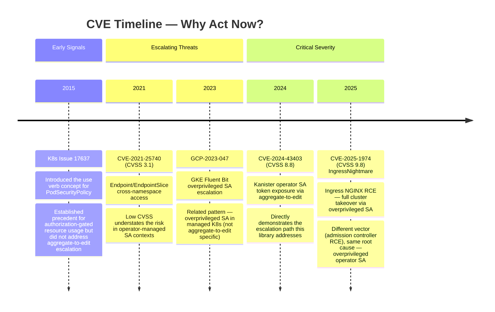
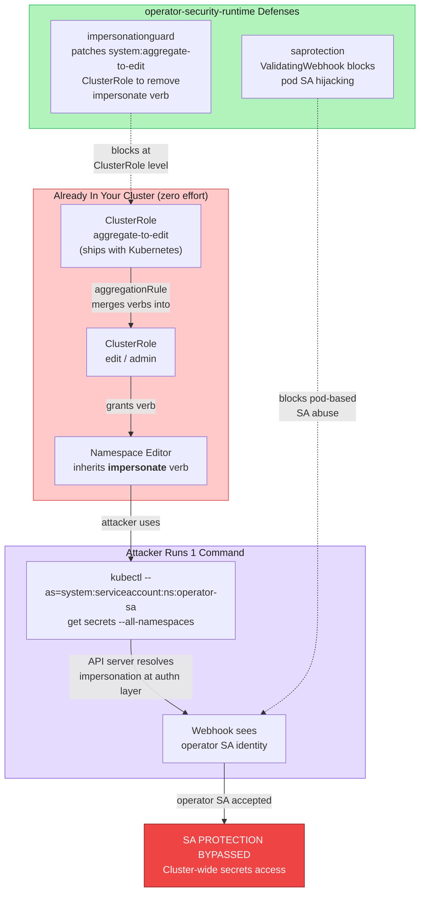
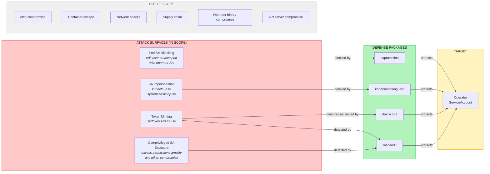
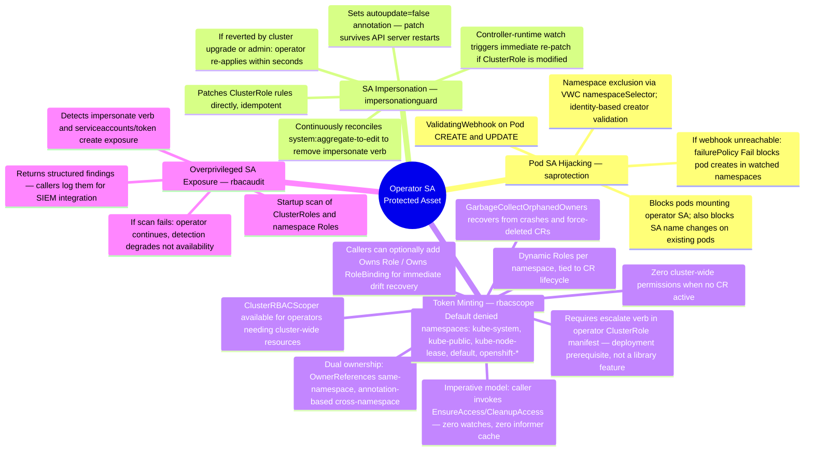
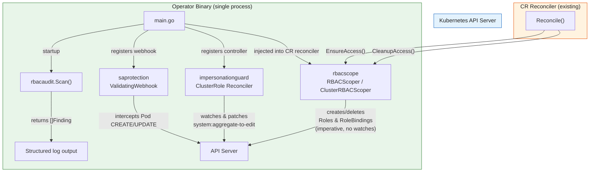
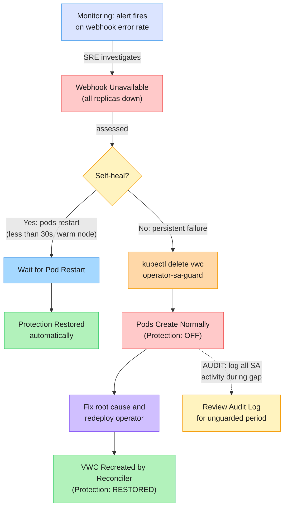

# operator-security-runtime

## Eliminating the ServiceAccount Impersonation Attack Surface in Multi-Namespace Operators

---

### Slide 1: Title

**operator-security-runtime**
*Eliminating the ServiceAccount Impersonation Attack Surface in Multi-Namespace Operators*

*CVE-2025-1974 (CVSS 9.8) showed what happens when an operator ServiceAccount (SA) is overprivileged — full cluster takeover. CVE-2024-43403 (CVSS 8.8) showed how easy the escalation path is: one kubectl command via aggregate-to-edit. This library closes that path.*

- Author: [Name], [Team]
- Date: 2026-03-09
- Audience: Architect Council
- Scope: All operators managing cross-namespace workloads via privileged SAs (starting with Open Data Hub (ODH) operator)
- Objective: Approve operator-security-runtime as recommended library, pilot rbacaudit across qualifying operators

**Acronyms used in this presentation**: SA (ServiceAccount), CR (Custom Resource), RBAC (Role-Based Access Control), VWC (ValidatingWebhookConfiguration), HA (High Availability), RCE (Remote Code Execution), CVSS (Common Vulnerability Scoring System), ODH (Open Data Hub)

---

### Slide 2: Executive Summary

**Problem**: Every Kubernetes operator that manages workloads across namespaces requires a highly privileged ServiceAccount. Today, these privileges are granted via static ClusterRoles — permanent, cluster-wide, and exploitable by any namespace editor via ServiceAccount impersonation (aggregate-to-edit, shipped in every cluster).

**Solution**: operator-security-runtime is a Go library providing 4 defense packages that protect operator ServiceAccounts through defense-in-depth: identity validation, verb restriction, dynamic scoping, and audit scanning.

**Evidence**:
- 0 cluster-wide permissions when no CR is active (down from permanent cluster-wide access today)
- 4 independently adoptable packages, each addressing a distinct attack vector — strongest when deployed together
- 1-5ms p99 webhook latency measured in [environment] (no external calls, no cache dependencies)
- 1 kubectl command is all an attacker needs under today's static RBAC model

**Library status**: operator-security-runtime is available at https://github.com/ugiordan/operator-security-runtime. Current maturity: alpha. Test coverage: ~90% (rbacaudit 94%, saprotection 92%, impersonationguard 88%, rbacscope 87%). The library has been validated against the attack scenarios described in this presentation in [environment].

---

### Slide 3: CVE Timeline — Why Act Now?

**Narrative**: The executive summary stated the risk. This slide provides the evidentiary record — the trajectory from design concern to weaponized exploit chain — so stakeholders can justify priority internally.



**Key point**: The trend is clear — SA overprovisioning has escalated from a design-level concern (2015) to a weaponized RCE chain (2025). CVE-2024-43403 demonstrates the exact aggregate-to-edit escalation path this library addresses. CVE-2025-1974 demonstrates the catastrophic impact when any overprivileged operator SA is compromised, regardless of vector.

---

### Slide 4: The Attack — aggregate-to-edit Escalation

**Narrative**: This is not a hypothetical attack. Every Kubernetes cluster ships with the prerequisite: the `aggregate-to-edit` ClusterRole. Any namespace editor can exploit it with a single command. This attack has been demonstrated against the ODH operator in [staging/test environment] on [date].



**Why this matters**: The API server resolves impersonation at the authentication layer — BEFORE admission webhooks execute. Webhooks see the impersonated identity as the requesting user. While Kubernetes audit logs DO capture `Impersonate-User` headers (so impersonation is logged), the webhook itself cannot distinguish the real caller from someone impersonating the operator SA at admission time. That is why `impersonationguard` must strip the `impersonate` verb from the ClusterRole proactively at startup, rather than relying on admission-time detection.

**Note**: The diagram shows two defense packages (see Slide 7 for full package definitions) because two distinct attack vectors exist. `saprotection` blocks pod-based SA hijacking; `impersonationguard` blocks API-level impersonation. Both are needed together — deploying only one leaves the other vector open.

**Verification**: The built-in `system:aggregate-to-edit` ClusterRole grants `impersonate` on `serviceaccounts` by default. Any ClusterRole carrying the label `rbac.authorization.k8s.io/aggregate-to-edit: "true"` gets its verbs merged into the edit role via aggregation. Verify the impersonate verb is present: `kubectl get clusterrole system:aggregate-to-edit -o yaml | grep -A5 impersonate`

---

### Slide 5: Impact — What's at Stake

**Without protection, a single compromised namespace editor can**:

| Impact | Detail |
|--------|--------|
| Read all Secrets | `kubectl --as=...operator-sa get secrets -A` |
| Modify any workload | Create, patch, delete Deployments across namespaces |
| Escalate to cluster-admin | If the SA holds escalate/bind on ClusterRoles, the attacker self-promotes to cluster-admin. Without those verbs, the SA's existing cross-namespace permissions still enable full data exfiltration |
| Exfiltrate data | Access model weights, training data, inference endpoints |
| Persist access | Create new ClusterRoleBindings for future access |

**Blast radius**: For the ODH operator, this means [N] namespaces and [N] secrets across all managed components (model serving, training, monitoring).

**Detection gap**: Kubernetes audit logs capture impersonation requests with the original user identity. However, when an attacker obtains a raw SA token (via volume mount or token API), requests are indistinguishable from legitimate operator activity in standard audit configurations. Every action in the table above appears as normal operator SA behavior. `rbacaudit` addresses this by scanning RBAC configurations at startup and producing structured logs that identify overprivileged SA exposure patterns.

---

### Slide 6: Threat Model — What We Cover (and What We Don't)

**Narrative**: A credible security design defines its scope. We protect against RBAC-level SA abuse. We explicitly do NOT claim to protect against infrastructure-level attacks.



**Defense classification**:
- **blocked by** (`saprotection`, `impersonationguard`) = preventive control (attack is stopped before it succeeds)
- **blast-radius limited by** (`rbacscope`) = scope reduction (token minting damage limited to CR namespaces only; full prevention requires upstream KEP-5284)
- **detected by** (`rbacaudit`) = detective control (scans ClusterRoles and Roles for impersonate verb and serviceaccounts/token create exposure; identifies configurations that amplify the impact of any token compromise; remediation is manual or via `rbacscope` adoption)

**Out of scope rationale**: These are infrastructure-layer concerns with dedicated tooling (Falco, Sigstore, Cilium, etcd encryption). Mixing them into an RBAC library would create false confidence. We integrate with these tools via structured audit logs; we do not replace them.

---

### Slide 7: Defense-in-Depth — The 4 Packages

**Narrative**: No single control is sufficient. Each package addresses a different attack vector from the threat model.



**Design principles**:
- Each package can be adopted independently — start with rbacaudit (zero risk), add others incrementally
- Each package has a defined failure mode (listed above) — no silent degradation
- No package depends on another, but `impersonationguard` + `saprotection` are complementary: `saprotection` blocks pod-based SA hijacking; `impersonationguard` blocks API-level impersonation. Deploying only one leaves the other vector open. Start with both, or with `rbacaudit` alone to assess exposure first

**Runtime integration** — all 4 packages embed into the operator binary with no external dependencies:



**rbacscope imperative model — why no watches?**

- **No watches**: rbacscope does not register controllers, informers, or watch streams on RBAC resources. Zero additional memory. Zero additional API server load.
- **Drift recovery**: Happens on the next CR reconcile. `EnsureAccess` uses `CreateOrUpdate` — idempotent, self-healing.
- **Immediate recovery** (optional): Callers can add `Owns(&rbacv1.Role{})` and `Owns(&rbacv1.RoleBinding{})` in their `SetupWithManager` to trigger re-reconciliation when managed RBAC resources are modified externally. Standard controller-runtime pattern — the library does not impose it.
- **Contrast with impersonationguard**: impersonationguard registers its own controller with a watch on `system:aggregate-to-edit`. This is appropriate because that ClusterRole can be reverted by cluster upgrades at any time. rbacscope's RBAC resources are tied to CR lifecycle and do not need independent watching.

---

### Slide 8: Before vs After — RBAC Model

**Narrative**: Of the four packages, `rbacscope` represents the deepest architectural change — moving from static cluster-wide RBAC to dynamic namespace-scoped RBAC tied to CR lifecycle. This slide and the next examine that shift and its trade-offs. `saprotection` and `impersonationguard` are straightforward preventive controls; `rbacscope` requires architectural understanding.

```mermaid
flowchart LR
    subgraph STATIC["STATIC ClusterRole (Today)"]
        direction TB
        S_CR["ClusterRoleBinding<br/>(always active)"]
        S_NS1["ns: model-serving"]
        S_NS2["ns: training"]
        S_NS3["ns: monitoring"]
        S_NS4["ns: unrelated"]
        S_CR --> S_NS1
        S_CR --> S_NS2
        S_CR --> S_NS3
        S_CR -->|"unnecessary access"| S_NS4
    end

    subgraph DYNAMIC_ACTIVE["DYNAMIC — CR Active"]
        direction TB
        D_CR["Scoped RoleBinding<br/>(per-namespace)"]
        D_NS1["ns: model-serving"]
        D_NS2["ns: training"]
        D_NS3["ns: monitoring"]
        D_NS4["ns: unrelated"]
        D_CR --> D_NS1
        D_CR --> D_NS2
        D_CR --> D_NS3
        D_CR -.- D_NS4
    end

    subgraph DYNAMIC_DELETED["DYNAMIC — CR Deleted"]
        direction TB
        DD_CR["No RoleBindings exist"]
        DD_NS1["ns: model-serving"]
        DD_NS2["ns: training"]
        DD_NS3["ns: monitoring"]
        DD_NS4["ns: unrelated"]
        DD_CR -.- DD_NS1
        DD_CR -.- DD_NS2
        DD_CR -.- DD_NS3
        DD_CR -.- DD_NS4
    end

    STATIC -- "migrate to<br/>operator-security-runtime" --> DYNAMIC_ACTIVE
    DYNAMIC_ACTIVE -- "CR deleted<br/>(cleanup)" --> DYNAMIC_DELETED

    style STATIC fill:#ffc9c9,stroke:#ef4444,color:#1e1e1e
    style DYNAMIC_ACTIVE fill:#b2f2bb,stroke:#22c55e,color:#1e1e1e
    style DYNAMIC_DELETED fill:#e5e5e5,stroke:#999,color:#1e1e1e
    style S_NS4 fill:#ffc9c9,stroke:#ef4444
    style D_NS4 fill:#e5e5e5,stroke:#999
    style DD_NS1 fill:#e5e5e5,stroke:#999
    style DD_NS2 fill:#e5e5e5,stroke:#999
    style DD_NS3 fill:#e5e5e5,stroke:#999
    style DD_NS4 fill:#e5e5e5,stroke:#999
    style DD_CR fill:#e5e5e5,stroke:#999
```



**Key differences**:
| Aspect | Static (Today) | Dynamic (Proposed) |
|--------|---------------|-------------------|
| Scope | All namespaces | Only CR namespaces |
| Lifetime | Permanent | CR lifecycle |
| "unrelated" namespace | Full access | No access |
| CR deleted | Still has access | Permissions removed |
| Audit trigger | No application-level trigger | CR create/delete events |
| Setup privilege | ClusterRoleBinding (one-time) | `escalate` verb on namespace Roles (ongoing, per-namespace) — trade-off analysis in Slide 9 |

**Coexistence during migration**: Static and dynamic RBAC can run simultaneously. rbacscope creates supplementary RoleBindings alongside existing ClusterRoleBindings. The static binding can be removed after validation.

---

### Slide 9: The escalate Trade-off

**Narrative**: This slide preempts the #1 objection: "You're using the escalate verb — isn't that dangerous?"


**The argument**: rbacscope dynamically creates Roles and RoleBindings. For this to work, the operator's ClusterRole manifest must grant the `escalate` verb — a deployment-time RBAC prerequisite, not something the library code itself invokes. This sounds alarming, but compare the risk profile:

| Dimension | Static ClusterRole (Today) | escalate + rbacscope (Proposed) |
|-----------|---------------------------|-------------------------------|
| Blast Radius | ALL namespaces, always | Only CR namespace |
| Temporal Scope | Permanent | CR lifecycle only |
| Who Can Exercise | Any API call using the SA | Only reconciler code |
| Audit Trail | No specific trigger | CR create/delete events |
| Escalation audit | None — static binding is pre-authorized | Every Role/RoleBinding creation logged as a distinct API event |

**The key insight**: To abuse the `escalate` verb, an attacker must obtain a valid token for the operator's SA — via binary compromise, token volume mount, or node-level credential theft. Every one of these vectors also compromises a static ClusterRole model — with far greater blast radius. The static SA already holds permanent cluster-wide permissions; no additional escalation step is needed. The `escalate` path provides stronger security properties in most measurable dimensions.

**Honest trade-off**: The `escalate` verb introduces a new escalation primitive that did not exist before. Within a namespace, `escalate` permits arbitrary Role creation — this is a real but bounded risk. The operator's ClusterRole manifest must grant `escalate` on namespace-scoped Roles only, never on ClusterRoles. This is enforced at the manifest level: the `escalate` verb is granted only on the `roles` and `rolebindings` resources, not on `clusterroles` or `clusterrolebindings`. The library code itself does not reference or exercise the escalate verb — it uses standard `controllerutil.CreateOrUpdate` calls; Kubernetes RBAC enforcement ensures the SA cannot exceed its granted permissions. Verify with: `kubectl get clusterrole <operator-clusterrole-name> -o yaml | grep -A10 escalate`

**Scope of escalate**: `RBACScoper` manages namespace-level Roles and RoleBindings — this is the default and recommended path. `ClusterRBACScoper` is also available for operators that genuinely need cluster-wide access to specific resources (e.g., nodes, namespaces); it manages ClusterRoles and ClusterRoleBindings with the same lifecycle guarantees. The escalate trade-off analysis above applies to the namespace-scoped `RBACScoper` path; operators using `ClusterRBACScoper` should evaluate the broader blast radius separately.

**Upstream context**: KEP-5284 (Constrained Impersonation) introduces verb-scoped impersonation restrictions. It reached alpha targeting K8s 1.34-1.35. It addresses impersonation privilege at the authorization layer but does not cover the broader aggregate-to-edit attack surface (daemonset manipulation, token minting) or dynamic RBAC scoping. operator-security-runtime fills the gaps that upstream does not address.

---

### Slide 10: Why Not Existing Tools?

**Narrative**: "Why build a custom library when OPA/Gatekeeper and Kyverno exist?"

| Capability | OPA/Gatekeeper | Kyverno | operator-security-runtime |
|------------|---------------|---------|--------------------------|
| Block pod SA hijacking | Yes (constraint template) | Yes (policy) | Yes (`saprotection`) |
| Remediate ClusterRole misconfigs at startup | Not designed for this | Not designed for this | Yes — idempotent, re-applied on reconciliation (`impersonationguard`) |
| Dynamic RBAC tied to CR lifecycle | Not designed for this; requires custom Rego + external state | Possible via generate rules, but lacks integrated lifecycle management and owner-reference cleanup | Yes — native reconciler integration (`rbacscope`) |
| Operator-specific RBAC audit | Generic policy audit only | Generic policy audit only | Yes — operator-aware SA analysis (`rbacaudit`) |
| Deployment model | Separate deployment + CRDs | Separate deployment + CRDs | Library embedded in operator |
| Operational overhead | High (separate infra) | Medium (separate infra) | Low (embedded; webhook requires HA management) |

**Key differentiator**: Policy engines operate at admission time. They cannot proactively remediate existing ClusterRole misconfigurations at startup, and while Kyverno's generate rules can create RoleBindings reactively, they lack the integrated lifecycle management, owner-reference-based cleanup, and startup remediation that this library provides.

**Complementary, not competing**: Organizations using Gatekeeper/Kyverno should continue using them for cluster-wide policy enforcement. operator-security-runtime addresses the operator-specific gap that generic policy engines cannot fill. Both can coexist — Gatekeeper enforces cluster policies, operator-security-runtime handles operator-internal SA protection.

---

### Slide 11: Operational Readiness — Webhook HA

**Narrative**: Security controls must not compromise availability. This slide demonstrates that the webhook is production-grade.


**Availability design** (deployment-level recommendations, not library-enforced):
| Feature | Detail |
|---------|--------|
| Replicas | 3 recommended (minimum 2 for HA) |
| Anti-affinity | Pod anti-affinity spreads replicas across nodes |
| PDB | minAvailable: 2 — prevents voluntary eviction below quorum; node failures handled by pod rescheduling |
| Namespace exclusion | `namespaceSelector` excludes `kube-system`, `openshift-*`, and operator namespace |
| Deadlock prevention | Webhook pods not subject to their own validation |
| Failure policy | `failurePolicy: Fail` — fail-secure, never fail-open |
| Timeout | `timeoutSeconds: 5` (configurable) — generous for 1-5ms operations |
| Latency | 1-5ms p99 (no external calls, no cache dependencies) |
| TLS certificates | Default: cert-manager. Alternatives: OLM CA injection (OpenShift), self-signed with 90-day auto-rotation |
| Health checks | Liveness and readiness probes on webhook server |
| Monitoring | controller-runtime built-in metrics: `controller_runtime_webhook_requests_total`, `controller_runtime_webhook_latency_seconds` |
| Alerting | Alert fires if error rate exceeds threshold or all replicas unready |

**Why failurePolicy: Fail?** A fail-open policy (Ignore) would silently disable protection during outages — exactly when an attacker might be causing the outage. Fail-secure ensures protection is always on or explicitly disabled via break-glass.

**Certificate rotation**: cert-manager handles rotation with overlap periods to prevent TLS disruption. The old certificate remains valid during the overlap window while the new certificate propagates. No pod creation failures during routine rotation.

**Operational guarantee**: If all webhook replicas are unavailable, pod creation in watched namespaces is blocked (`failurePolicy: Fail`). This is a deliberate design choice — brief pod creation delays are preferable to silent security degradation. Slide 12 covers the recovery procedure (<30 seconds for self-healing, one kubectl command for persistent failures).

**During operator upgrades**: Rolling update with PDB ensures at least 2 replicas remain available. Zero-downtime upgrades are the default. If an upgrade introduces a crash loop, the break-glass procedure applies (see next slide).

**Attack surface of the webhook itself**: The webhook introduces a new privileged component. Its SA requires only `get`/`list` on Pods and ServiceAccounts — no write permissions, no secrets access. The webhook namespace is excluded from its own validation (deadlock prevention). Compromise of the webhook SA does not grant escalation privileges because it has no `escalate`, `bind`, or `impersonate` verbs.

---

### Slide 12: Operational Readiness — Break-Glass Recovery

**Narrative**: Every security control needs an escape hatch. Here is the documented, auditable procedure.



**Recovery steps**:
1. **Detection**: Prometheus alert fires on webhook error rate or replica unavailability.
2. **Automatic self-heal** (most cases): Pod anti-affinity and 3 replicas ensure that single-node failures leave 2 healthy replicas. Crashed pods restart in <30s on warm nodes (container restart, no image pull).
3. **Manual break-glass** (persistent failure): `kubectl delete validatingwebhookconfiguration operator-sa-guard` — immediate effect (~seconds). Requires cluster-admin or dedicated break-glass ClusterRole (bound to SRE team only).
4. **Restore protection**: Fix root cause, redeploy operator. Reconciler automatically recreates the VWC.
5. **Audit gap**: Review K8s audit logs for any SA activity during the unprotected window.

**Access control**: VWC deletion requires cluster-admin or a dedicated break-glass ClusterRole. Namespace-scoped editors cannot modify cluster-scoped resources. The deletion itself is an audited cluster-level event.

**If the operator itself is in a crash loop**: The VWC remains deleted until the root cause is resolved and the operator is redeployed successfully. Protection is explicitly off during this window — audit logs cover the gap.

**Runbook**: A detailed runbook will be published to [location] before GA, covering each scenario with exact commands, expected outputs, and escalation contacts.

---

### Slide 13: Testing and Quality

**Test strategy**:
| Level | Coverage | What is tested |
|-------|----------|----------------|
| Unit tests | ~90% avg coverage (rbacaudit 94%, saprotection 92%, impersonationguard 88%, rbacscope 87%) | All packages: positive cases, negative cases, edge cases (table-driven) |
| Integration tests | envtest (controller-runtime) | Webhook: allowed pod creation, blocked pod with hijacked SA, impersonation detection. rbacscope: RoleBinding lifecycle |
| E2E tests | [Kind/OpenShift] | Full attack chain (create pod with operator SA → verify rejection), break-glass procedure (delete VWC → verify recovery), rbacscope lifecycle (create CR → verify RoleBinding → delete CR → verify cleanup) |
| Chaos tests | Webhook pod failure under load | Verified PDB prevents deadlock, recovery within [N]s |

**Race condition handling**: rbacscope uses owner references on RoleBindings, ensuring garbage collection even if the operator crashes. RoleBinding creation is idempotent — concurrent CR operations in the same namespace converge to the correct state. RoleBindings are created as the first reconciliation step, before any workload creation.

**Compatibility matrix**:
| Platform | Versions | Status |
|----------|----------|--------|
| Kubernetes | 1.27 - 1.34 | Tested in CI |
| OpenShift | 4.14 - 4.17 | Tested in CI |
| controller-runtime | v0.16+ | Supported |

**OpenShift considerations**:
- Operators installed via OLM have CSV-managed RBAC. rbacscope creates supplementary RoleBindings without modifying CSV-managed resources.
- Webhook pods run with the `restricted` SCC. No elevated privileges required.
- The webhook runs alongside OpenShift's built-in admission plugins without conflict.

---

### Slide 14: Adoption Path

**Migration strategy**: Incremental, reversible, zero-downtime.

| Phase | Package | Risk | Rollback | Bake time |
|-------|---------|------|----------|-----------|
| 0 | Approve as recommended library | None | N/A | Immediate |
| 1 | rbacaudit | None — read-only scan | Remove import | 1 sprint |
| 2 | saprotection | Low — webhook with fail-secure | Delete VWC | 2 sprints |
| 3 | impersonationguard | Medium — patches built-in aggregate-to-edit ClusterRole | Revert CR patch; `kubectl apply` original | 2 sprints |
| 4 | rbacscope | Medium — changes RBAC model | Reapply static ClusterRoleBinding from snapshot | 2 sprints |

**Phase 1 (rbacaudit)** is a no-risk starting point: it runs at startup, scans existing RBAC, and reports findings. No mutations. No webhooks. No runtime overhead. Teams assess their exposure before committing to protection.

**Phase 3 note**: impersonationguard patches `aggregate-to-edit`, a built-in Kubernetes ClusterRole. Users who require impersonation can still be granted it explicitly via dedicated ClusterRoleBindings. A pre-flight check scans for existing impersonation usage and reports any bindings that would be affected. The patch is idempotent and reversible.

**Phase 4 progressive adoption**: rbacscope provides `DeferToStaticRBAC()` — an escape hatch that creates empty Roles for lifecycle tracking only, without enforcing an allowed-rules ceiling. Teams can adopt rbacscope for ownership tracking and GC first, then define `AllowedRules` to enforce a permission ceiling later. This significantly lowers Phase 4 risk.

**Phase 4 prerequisite**: Before migrating to rbacscope, teams must snapshot existing ClusterRoles and ClusterRoleBindings (`kubectl get clusterrole,clusterrolebinding -o yaml > rbac-snapshot.yaml`). Rollback depends on this snapshot.

**Integration effort**: Each package is a single import + configuration in the operator's main.go. No CRDs, no separate deployments, no additional containers. Estimated integration time per operator: 1-2 days including testing.

```go
// Example: adding saprotection to an operator
import "github.com/opendatahub-io/operator-security-runtime/pkg/saprotection"

func main() {
    mgr, err := ctrl.NewManager(...)
    if err != nil {
        setupLog.Error(err, "unable to create manager")
        os.Exit(1)
    }

    if err := saprotection.SetupPodWebhookWithManager(mgr, []saprotection.ProtectedIdentity{
        {
            Namespace:          "operator-system",
            ServiceAccountName: "operator-sa",
        },
    }); err != nil {
        setupLog.Error(err, "failed to setup saprotection") // fail-fast: security misconfiguration must not be silent
        os.Exit(1)
    }

    if err := mgr.Start(ctx); err != nil {
        setupLog.Error(err, "unable to start manager")
        os.Exit(1)
    }
}
```

`SetupPodWebhookWithManager` registers a ValidatingWebhookConfiguration with the manager. The webhook is created when the manager starts and reconciled continuously.

---

### Slide 15: Summary and Call to Action

**What we presented**:
1. SA abuse is a real, escalating threat (CVEs up to CVSS 9.8)
2. Today's static ClusterRoles are exploitable with 1 command
3. operator-security-runtime provides 4-layer defense-in-depth
4. Dynamic scoping with `escalate` is safer than static ClusterRoles in most measurable dimensions, with a bounded complexity trade-off (see Slide 9)
5. The webhook is HA, fail-secure, with documented break-glass and monitoring
6. Existing policy engines (Gatekeeper, Kyverno) cannot replace this — they complement it
7. Adoption is incremental, reversible, and low-effort (1-2 days per operator)

**What we're asking for**:
1. Approve operator-security-runtime as a **recommended library** for all operators managing cross-namespace workloads via privileged ServiceAccounts
2. **Pilot Phase 1** (rbacaudit, read-only) across [operator-1, operator-2, operator-3] within 2 sprints to assess exposure, with results presented to council before broader rollout
3. Fund Phase 2-4 rollout: 1 engineer per adopting team, 1 quarter timeline, with go/no-go gate after Phase 1 results are reviewed
4. Designate [team] as library maintainer with on-call rotation for break-glass support

**Why a library, not a standalone controller?** A centralized controller would mean one team maintains it, but introduces a hard dependency, version coupling, and a single point of failure for all operators. A library approach means each operator team controls their upgrade cadence, can adopt packages incrementally, and has no external runtime dependency beyond their own binary. The trade-off is N teams must independently upgrade — mitigated by semver with a 1-release deprecation cycle and automated dependency update tooling.

**Maintenance commitment**:
- Maintained by [team], with [N] active contributors with merge permissions
- Security patches: SLA of 48h for critical, 1 week for high severity
- Upstream K8s compatibility: tested against N-2 releases
- The library is ~2.1 KLOC (production code) and can be absorbed into any operator if maintenance ceases (forking plan)

**Deprecation criteria**: If upstream Kubernetes provides equivalent protection — specifically: (1) constrained impersonation via KEP-5284 GA, (2) `use` verb enforcement for SA token mounting, (3) native dynamic RBAC scoping tied to resource lifecycle, AND (4) operator-aware RBAC audit — we deprecate the corresponding packages. Each package can be retired independently. Until then, we fill gaps that upstream has explicitly left open.

**Risk of inaction**: Every operator we ship today has a known, exploitable privilege escalation path. The risk is quantifiable: [N] operators with [N] overprivileged SAs across [N] namespaces. For impersonation-based attacks, standard audit logs capture the original user identity. For token-theft attacks, the activity is indistinguishable from legitimate operator behavior.

**Decision**: Adopt / Defer / Reject

---
