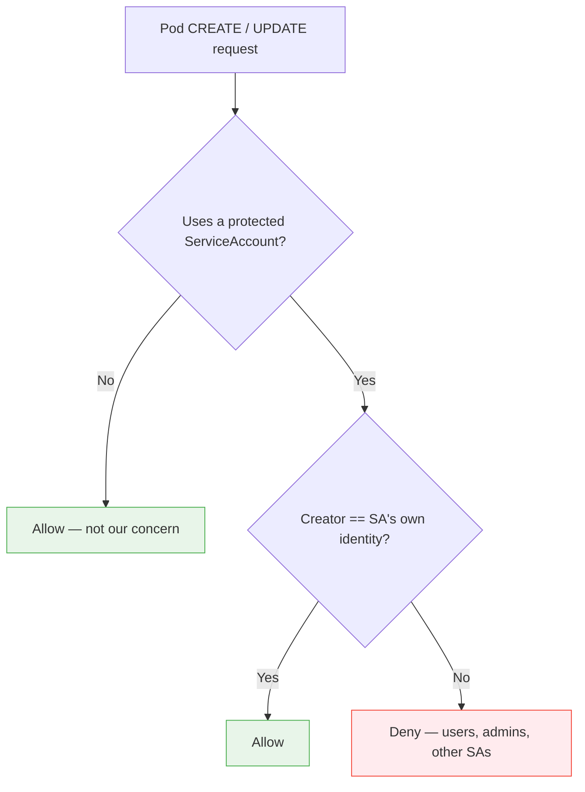
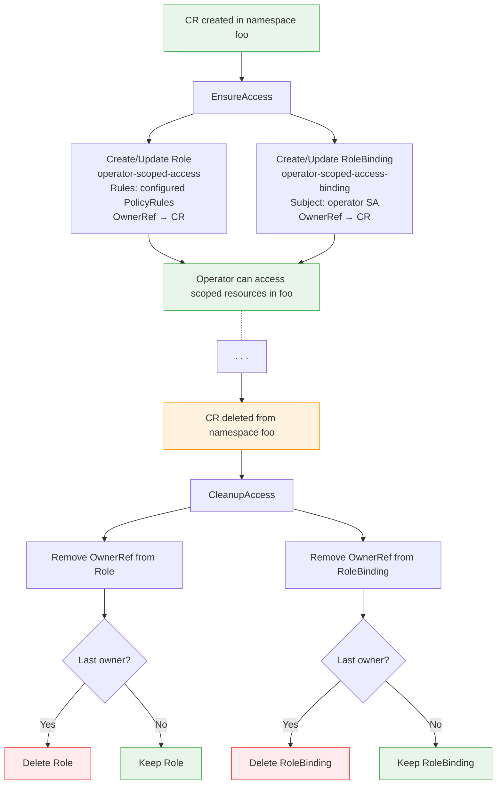
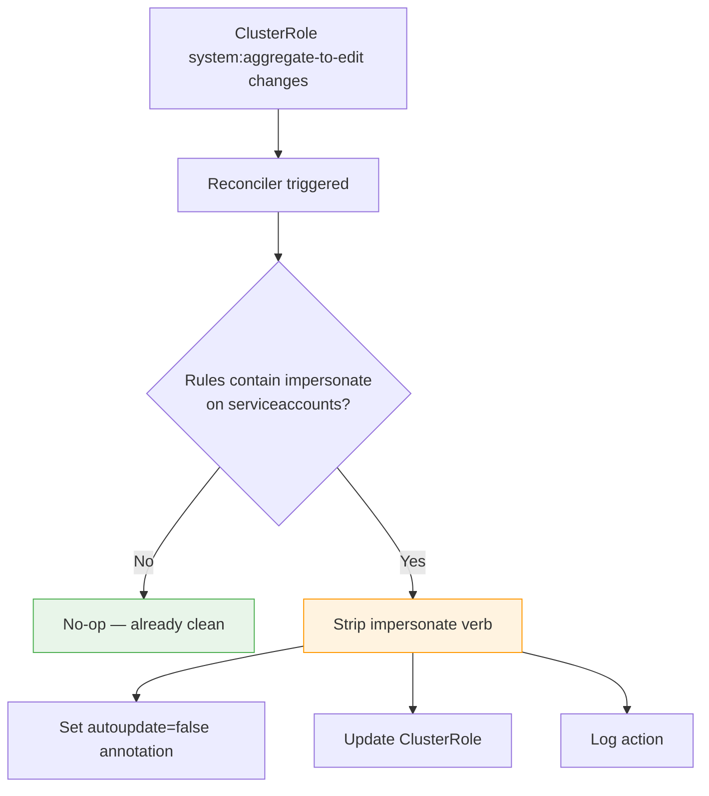

# Technical Design: Operator ServiceAccount Hardening

This document consolidates the full technical design for hardening Kubernetes operator ServiceAccounts against unauthorized usage and excessive static permissions. It merges content from five original design documents (ARCHITECTURE.md, DESIGN_RATIONALE.md, IMPLEMENTATION_GUIDE.md, RBAC_SCOPING.md, and DEMO.md) into a single reference.

---

## 1. Problem Analysis

### Root Cause

Kubernetes RBAC has a design gap around ServiceAccount usage in pod creation. The standard `edit` ClusterRole permits users to create pods referencing **any** ServiceAccount in their namespace, including privileged operator ServiceAccounts. There is no field-level restriction on `spec.serviceAccountName`:

```yaml
# Standard 'edit' ClusterRole allows pod creation without SA restrictions
apiVersion: rbac.authorization.k8s.io/v1
kind: ClusterRole
metadata:
  name: edit
rules:
- apiGroups: [""]
  resources: ["pods"]
  verbs: ["create", "delete", "get", "list", "patch", "update", "watch"]
  # No restriction on spec.serviceAccountName
```

The `use` verb for ServiceAccounts exists in the Kubernetes API but is **not enforced** in default roles:

```yaml
# This would enforce SA isolation, but is NOT in the default 'edit' role
- apiGroups: [""]
  resources: ["serviceaccounts"]
  verbs: ["use"]  # Not checked during pod creation
```

This means a user with `edit` permissions can create a pod that runs with the operator's identity. The pod inherits all RBAC permissions of the operator's ServiceAccount, and actions from that pod appear to originate from the operator.

### Why Standard RBAC Does Not Solve This

| Approach | Issue |
|----------|-------|
| Restrict `edit` role | Breaks standard user workflows (users cannot create pods) |
| Add `use` verb to `edit` role | Not enforced consistently in upstream Kubernetes |
| Restrict SA creation | Users need ServiceAccounts for their own workloads |
| Namespace isolation | Operators often need to work across namespaces |

### Impact Assessment

**Confidentiality** -- A user gains access to all secrets accessible by the operator ServiceAccount. Operator ServiceAccounts often have cluster-wide secrets read permissions, exposing every secret in every namespace.

**Integrity** -- A user can modify resources using the operator's RBAC permissions. This includes manipulating operator-managed workloads and creating or updating RBAC resources to grant themselves broader permissions.

**Availability** -- A user could disrupt operator functionality or exhaust resources via privileged pod creation.

### Attack Scenarios

**Scenario 1: Secret Access.** A user creates a pod with an operator SA that has `get/list/watch` on secrets cluster-wide. All cluster secrets become accessible to the user through that pod.

**Scenario 2: Privilege Escalation.** A user creates a pod with an operator SA that has `create/update` on RBAC resources. The user grants themselves broader permissions, escalating beyond their original `edit` role.

**Scenario 3: Lateral Movement.** A user creates a pod with an operator SA that can access other namespaces. The user accesses resources in production namespaces from a development namespace.

### Affected Operators

Any Kubernetes operator with elevated RBAC permissions is affected. Operators typically need cluster-wide access to secrets, ability to create and modify resources across namespaces, and elevated permissions for managing CRDs and RBAC. In multi-operator platforms, the scope of exposure is proportional to the number of operators deployed.

---

## 2. Solution Architecture

A defense-in-depth approach with three complementary mechanisms:

1. **SA Identity Protection (ValidatingWebhook)** -- Enforces creator identity checks at pod admission time, preventing unauthorized ServiceAccount usage.
2. **Dynamic RBAC Scoping** -- Replaces static cluster-wide secrets access with namespace-scoped grants tied to CR lifecycle.
3. **Impersonation Guard (Reconciler)** -- Strips the `impersonate` verb from `system:aggregate-to-edit`, closing the impersonation bypass that would otherwise allow any namespace editor to circumvent the webhook.

### Alternatives Considered

| Approach | Pros | Cons | Decision |
|----------|------|------|----------|
| **RBAC `use` verb** | Kubernetes-native | Inconsistently enforced, not in default roles | Rejected |
| **MutatingWebhook** | Could rewrite SA field | Does not prevent, just modifies | Rejected |
| **ValidatingWebhook** | Precise control, reliable enforcement | Requires webhook infrastructure | **Selected** |
| **Pod Security Admission** | Kubernetes-native | Cannot check creator identity | Rejected |

### Why ValidatingWebhook Wins

1. **Precise Control** -- Can check both pod spec AND creator identity in a single admission request.
2. **Reliable Enforcement** -- Guaranteed to run before pod creation completes.
3. **Works Today** -- No waiting for upstream Kubernetes features or proposals.
4. **Vanilla K8s Compatible** -- No OpenShift-specific dependencies required.
5. **Standard Pattern** -- Operators already use webhooks; the infrastructure exists.

### Why All Three Mechanisms Are Needed

- **Webhook alone:** Prevents unauthorized pod creation using the operator SA, but the SA still has cluster-wide resource access if compromised through other vectors (e.g., token minting, impersonation).
- **RBAC scoping alone:** Limits resource access to relevant namespaces, but does not prevent unauthorized users from creating pods with the operator's identity.
- **Webhook + RBAC scoping without impersonation guard:** Unauthorized users cannot create pods with the operator SA, and permissions are scoped -- but the default `system:aggregate-to-edit` grants `impersonate` on `serviceaccounts`, allowing any namespace editor to bypass the webhook entirely.
- **All three together:** Unauthorized users cannot use the operator's identity (webhook), the SA's permissions are limited to namespaces with active CRs (RBAC scoping), and the impersonation bypass is closed (impersonation guard).

---

## 3. Mechanism 1: SA Identity Protection (`pkg/saprotection`)

### Core Logic Flow



The webhook distinguishes two different identities in every pod creation:

- `pod.Spec.ServiceAccountName` -- the ServiceAccount the pod will **run as**.
- `request.UserInfo.Username` -- **who** is creating the pod.

The gap exploits this distinction: User A creates a pod that runs as Operator SA. Without the webhook, this is allowed. With the webhook, it is denied because User A is not the Operator SA.

### Key Design Decisions

**Name-only SA matching (intentional defense-in-depth).** The webhook matches on ServiceAccount **name** only, not namespace+name. The `ProtectedIdentity.Namespace` field is used only to construct the expected creator identity string (`system:serviceaccount:<namespace>:<name>`). If a legitimate ServiceAccount in another namespace shares the same name as a protected one, it will also be restricted. This is an intentional tradeoff: it prevents users from creating a same-named SA in a different namespace to bypass protection.

**Fail-secure behavior (`failurePolicy: Fail`).** If the webhook is unavailable, pod creation is blocked entirely. If the admission context cannot be extracted, the request is denied with an explicit error. This ensures that a webhook outage does not silently open the gap.

| Scenario | Behavior | Reason |
|----------|----------|--------|
| Webhook unavailable | Pod creation blocked | `failurePolicy: Fail` |
| Cannot extract admission context | Pod creation denied | Explicit fail-secure code |
| SA name not in protected list | Pod creation allowed | Not our concern |

**Namespace selector (excludes system namespaces).** The webhook uses a `namespaceSelector` to exclude critical namespaces and the operator's own namespace:

```yaml
namespaceSelector:
  matchExpressions:
    - key: kubernetes.io/metadata.name
      operator: NotIn
      values:
        - kube-system
        - kube-public
        - kube-node-lease
        - <operator-namespace>
```

Excluding the operator namespace prevents a deadlock where the webhook pod cannot restart because it needs webhook approval to start.

**Update short-circuit (no overhead on kubelet status updates).** Pod updates that do not change the ServiceAccount are short-circuited with no validation overhead. Since the kubelet frequently updates pod status, this avoids adding latency to the vast majority of update requests.

**Configurable protected identities.** The webhook supports protecting multiple ServiceAccounts via a list of `ProtectedIdentity` structs, each specifying a namespace and ServiceAccount name. Configuration is driven by environment variables:

- `OPERATOR_SA_NAME` -- ServiceAccount name to protect.
- `OPERATOR_NAMESPACE` -- Namespace of the operator.
- `OPERATOR_NAME` -- Operator name used to generate Role/RoleBinding names.

### Enforcement Policy

The webhook blocks **everyone** except the operator ServiceAccount itself:

```
ALLOW: system:serviceaccount:<namespace>:<sa-name>
DENY:  user@redhat.com
DENY:  admin@redhat.com (even cluster-admin)
DENY:  system:serviceaccount:other-namespace:other-sa
```

This is the strictest possible enforcement. Rationale: defense in depth (compromised admin accounts are also protected) and principle of least privilege.

### Edge Cases

**Cluster-admin creates pod with operator SA.** Result: Denied. Creator identity does not match. Even cluster admins are blocked; this is intentional defense-in-depth.

**ServiceAccount impersonation.** Result: Allowed (if impersonating the operator SA itself). This is a known gap: the default Kubernetes `system:aggregate-to-edit` ClusterRole grants `impersonate` on `serviceaccounts`, which aggregates into `edit` and `admin` roles. Any namespace editor can impersonate SAs in their namespace. The `pkg/impersonationguard` package addresses this by stripping the `impersonate` verb from `system:aggregate-to-edit`.

**Operator creates pod in user namespace.** Result: Allowed. Creator is the operator ServiceAccount, which matches the protected identity.

**Different ServiceAccount.** Result: Allowed. The webhook only protects configured ServiceAccounts and does not interfere with unrelated pods.

**Kubelet status updates.** Result: Short-circuited. No validation overhead since the ServiceAccount field is unchanged.

### Performance

- **Latency:** ~1-5ms added to pod creation (string comparison only).
- **Throughput:** Minimal impact (webhook is stateless, no external calls).
- **Updates:** Short-circuited when SA is unchanged (no overhead on kubelet updates).

---

## 4. Mechanism 2: Dynamic RBAC Scoping (`pkg/rbacscope`)

### Problem

Operators in the platform use static ClusterRoles that grant cluster-wide resource access (e.g., secrets, configmaps). In practice, each operator only needs resource access in namespaces where its Custom Resources exist. Granting cluster-wide access when namespace-scoped access is sufficient violates the principle of least privilege.

### CR Lifecycle Flow

The reconciler action chain during CR reconciliation:

1. **CR created in a namespace** -- `EnsureAccess` creates a namespace-scoped Role with the configured `PolicyRules` (e.g., secrets with `get`, `list`, `watch`) and a RoleBinding binding it to the operator's ServiceAccount. Both resources carry an OwnerReference pointing to the CR.

2. **Business logic proceeds** -- The operator proceeds with its normal reconciliation. It can now access the scoped resources in this namespace because the Role and RoleBinding are in place.

3. **CR deleted from a namespace** -- The finalizer calls `CleanupAccess`, which explicitly deletes the Role and RoleBinding before removing the finalizer. This provides deterministic cleanup without relying solely on garbage collection.

4. **Static ClusterRole** -- The operator's ClusterRole contains only RBAC management permissions (`create`, `delete`, `get` on Roles and RoleBindings). It has **no** scoped resource permissions. Resource access exists only in namespaces with active CRs.



### Multi-CR Ownership

OwnerReferences on the Role and RoleBinding support multiple CRs in the same namespace. When multiple CRs exist in a single namespace, each adds itself as an owner of the same Role and RoleBinding resources. Cleanup only deletes the Role and RoleBinding when no owners remain. This ensures that deleting one CR does not revoke access needed by another CR in the same namespace.

### Escalate Verb

Kubernetes prevents ServiceAccounts from creating Roles that grant permissions they do not themselves hold. Since the operator's static ClusterRole has **no** scoped resource permissions, the operator needs the `escalate` verb on `roles` in the `rbac.authorization.k8s.io` API group. This verb allows the operator to create Roles granting permissions beyond its own.

The `escalate` verb is a Kubernetes built-in mechanism specifically designed for controllers that manage RBAC on behalf of users. This is the standard pattern used by Kubernetes controllers like the namespace controller and the service catalog.

Required ClusterRole permissions:

```yaml
- apiGroups: ["rbac.authorization.k8s.io"]
  resources: ["roles"]
  verbs: ["get", "list", "watch", "create", "update", "delete", "escalate"]
- apiGroups: ["rbac.authorization.k8s.io"]
  resources: ["rolebindings"]
  verbs: ["get", "list", "watch", "create", "update", "delete"]
```

### Coverage

| Team | CR Type | Scoped Resources | Verbs | Covered |
|------|---------|-------------------|-------|---------|
| DSPO | DSPA | secrets | get, list, watch | Yes |
| Notebooks | Notebook | secrets | get, create, update | Yes |
| Ray | RayCluster | secrets | get, list, watch | Yes |
| Feast | FeatureStore | secrets | get, list, watch | Yes |
| Model Controller | InferenceService | secrets, configmaps | get, list, watch | Yes |
| Dashboard | N/A (no CR) | secrets | get, create, update | No |
| Model Registry | N/A | N/A | N/A | N/A |

The `Rules` field accepts any `[]rbacv1.PolicyRule`, so operators that need access to multiple resource types (e.g., secrets and configmaps) can express this in a single `RBACScoper` instance. Dashboard does not use a CR-based pattern, so a different approach is needed. Model Registry does not access secrets at all.

### Out of Scope

- **Dashboard** -- Dashboard does not have a CR that triggers per-namespace reconciliation. A different pattern (e.g., watch-based or configuration-driven) is needed to scope its resource access.
- **Auth-delegator centralization** -- Several operators bind to the `system:auth-delegator` ClusterRole. Centralizing or reducing these bindings is a separate effort.

---

## 5. Mechanism 3: Impersonation Guard (`pkg/impersonationguard`)

### Problem

Kubernetes impersonation is handled at the **authentication layer**, before any
admission webhook fires. When a user runs
`kubectl --as=system:serviceaccount:<ns>:<sa>`, the API server authenticates
the request as the impersonated identity. By the time the SA protection webhook
(Mechanism 1) sees the request, `request.UserInfo.Username` is already the
impersonated ServiceAccount -- the webhook cannot distinguish between a real SA
and an impersonated one.

The default `system:aggregate-to-edit` ClusterRole contains:

```yaml
- apiGroups: [""]
  resources: ["serviceaccounts"]
  verbs: ["impersonate"]
```

This aggregates into `edit` and `admin` via the
`rbac.authorization.kubernetes.io/aggregate-to-edit: "true"` label. Any user
with `edit` or `admin` in a namespace can impersonate any ServiceAccount in
that namespace -- including operator ServiceAccounts. This is a known gap
that renders webhook-based SA protection incomplete.

### Why Webhooks Cannot Solve This

| Layer | When it runs | Can it see real caller? |
|-------|-------------|----------------------|
| Authentication (impersonation) | First | N/A -- it IS the identity resolution |
| Authorization (RBAC check) | Second | Yes, but only to authorize the impersonation itself |
| Admission (webhooks) | Third | No -- `UserInfo` already reflects the impersonated identity |

A ValidatingWebhook or MutatingWebhook cannot intercept or deny the
impersonation itself. By design, impersonation is resolved before the admission
chain begins.

### Reconciler Approach

The `ImpersonationGuardReconciler` watches the `system:aggregate-to-edit`
ClusterRole and removes the `impersonate` verb from any rule targeting
`serviceaccounts`. The reconciler:

1. **Filters events** to only process `system:aggregate-to-edit` (using
   predicates that match on the ClusterRole name).
2. **Strips the verb** -- iterates over all rules, finds rules targeting
   `serviceaccounts`, and removes `impersonate` from the verb list. If
   `impersonate` was the only verb, the entire rule is dropped.
3. **Sets `rbac.authorization.kubernetes.io/autoupdate: "false"`** -- this
   annotation tells the Kubernetes RBAC controller not to restore the
   ClusterRole to its default state on API server restart.
4. **Is idempotent** -- if the ClusterRole is already clean, the reconciler
   does nothing.



### ValidatingAdmissionPolicy Companion

Stripping the verb from `system:aggregate-to-edit` prevents the default grant,
but does not prevent a cluster user from creating a **new** ClusterRole or Role
that grants `impersonate` on `serviceaccounts`. The
`config/validatingadmissionpolicy/deny-impersonate-grants.yaml` artifact
deploys a ValidatingAdmissionPolicy (Kubernetes 1.30+ / OCP 4.17+) that:

- Matches `CREATE` and `UPDATE` on `clusterroles` and `roles`
- Skips system users (usernames starting with `system:`)
- Denies any role containing a rule with `impersonate` on `serviceaccounts`

This is a CEL-based policy that runs in the API server without requiring a
webhook. It complements the reconciler: the reconciler fixes the existing
default, and the policy prevents new grants.

### Future: KEP-5284 Constrained Impersonation

Kubernetes Enhancement Proposal KEP-5284 proposes constrained impersonation,
which would allow cluster administrators to restrict which identities a user
can impersonate and under what conditions. When this KEP reaches GA, it may
provide a native alternative to the reconciler approach. Until then, the
combination of the impersonation guard reconciler and the
ValidatingAdmissionPolicy provides equivalent protection.

---

## 6. Key Architectural Tradeoffs

### 1. Name-Only SA Matching

The webhook matches on ServiceAccount name regardless of namespace. If a legitimate ServiceAccount in another namespace shares the same name as a protected operator SA, it will also be restricted from being used in pod specs by non-matching creators.

**Tradeoff:** Legitimate same-named ServiceAccounts in other namespaces are also restricted. **Accepted** for defense-in-depth. The alternative (namespace+name matching) would allow users to create a same-named ServiceAccount in a different namespace and use it to bypass the protection. The risk of over-restriction is lower than the risk of under-restriction.

### 2. Escalate Verb Requirement

The operator needs the `escalate` verb on `roles` in the `rbac.authorization.k8s.io` API group to create Roles granting resource permissions that the operator itself does not statically hold.

**Tradeoff:** Broader RBAC management capability -- the operator can theoretically create Roles granting any permission. **Accepted** because this is the standard Kubernetes pattern for controllers managing RBAC. The alternative (granting the operator static resource permissions and avoiding `escalate`) defeats the purpose of dynamic scoping. The `escalate` verb is a deliberate Kubernetes API surface for exactly this use case.

### 3. Finalizer vs OwnerRef GC

The design uses **both** finalizer-based cleanup AND OwnerReferences. The finalizer ensures deterministic, immediate cleanup when a CR is deleted. The OwnerReferences provide a safety net via Kubernetes garbage collection if the finalizer cleanup is missed (e.g., due to a crash during deletion).

**Tradeoff:** Belt-and-suspenders approach adds implementation complexity but ensures deterministic cleanup even if garbage collection is delayed. **Accepted** because security-critical resources (RBAC grants) should not rely on a single cleanup mechanism. The complexity cost is bounded and well-understood.

### 4. RoleBinding Drift Handling

The `roleRef` field on a RoleBinding is immutable in Kubernetes. If an external actor changes the `roleRef` (which requires deleting and recreating the RoleBinding), or if the existing RoleBinding points to a different Role than expected, the reconciler deletes the RoleBinding and recreates it with the correct `roleRef`.

**Tradeoff:** There is a brief window during recreation where no RoleBinding exists, temporarily revoking the operator's secrets access in that namespace. **Accepted** because this scenario (external mutation of operator-managed RoleBindings) is exceptional, and the window is milliseconds. The alternative (tolerating drift) would leave the operator bound to the wrong Role.

---

## 7. Demo Walkthrough

### Prerequisites

- Kubernetes cluster (Kind recommended for demo)
- kubectl configured
- Repository cloned

### Part 1: Setup

**Create Kind cluster:**

```bash
kind create cluster --name sa-isolation-demo
```

**Build and load operator image:**

```bash
make docker-build IMG=example-operator:demo
kind load docker-image example-operator:demo --name sa-isolation-demo
```

**Deploy operator WITHOUT webhook:**

```bash
make deploy IMG=example-operator:demo
kubectl set env deployment/k8s-serviceaccount-hijacking-protection-controller-manager \
  -n k8s-serviceaccount-hijacking-protection-system ENABLE_WEBHOOKS=false
kubectl delete validatingwebhookconfigurations \
  k8s-serviceaccount-hijacking-protection-validating-webhook-configuration \
  --ignore-not-found=true
```

### Part 2: Demonstrate the Gap

Create user namespace with standard `edit` role and attempt pod creation with the operator's ServiceAccount:

```bash
kubectl apply -f attack/user-namespace.yaml
kubectl apply -f attack/exploit.yaml
```

**Expected output:**

```
pod/malicious-pod created
```

The pod is created successfully. Verify it is running with operator privileges:

```bash
kubectl wait --for=condition=Ready pod/malicious-pod -n user-project --timeout=30s
kubectl logs -n user-project malicious-pod
```

**Expected output:**

```
=== ServiceAccount Isolation Test ===

ServiceAccount Token:
eyJhbGciOiJSUzI1NiIsImtp...

=== Pod is running with the operator's ServiceAccount ===
This pod has access to all permissions granted to the operator.
```

Clean up before proceeding:

```bash
kubectl delete -f attack/exploit.yaml
```

### Part 3: Deploy the Solution

Re-deploy operator WITH webhook enabled:

```bash
kubectl set env deployment/k8s-serviceaccount-hijacking-protection-controller-manager \
  -n k8s-serviceaccount-hijacking-protection-system ENABLE_WEBHOOKS-
make deploy IMG=example-operator:demo
```

Verify webhook configuration:

```bash
kubectl get validatingwebhookconfigurations
```

Key fields to note: `failurePolicy: Fail` (fail-secure), `namespaceSelector` (excludes system namespaces), `rules: pods CREATE/UPDATE`.

### Part 4: Verify Protection

Attempt the same pod creation:

```bash
kubectl apply -f attack/exploit.yaml
```

**Expected output:**

```
Error from server (Forbidden): error when creating "attack/exploit.yaml":
admission webhook "vpod-v1.kb.io" denied the request:
unauthorized: pods may not use ServiceAccount "k8s-serviceaccount-hijacking-protection-controller-manager"
unless created by the operator itself; request was made by "kubernetes-admin"
```

Verify even cluster-admin is blocked:

```bash
kubectl apply -f attack/exploit.yaml --as=admin --as-group=system:masters
```

**Expected:** Denied.

### Part 5: RBAC Scoping Demo

Run the dedicated demo script to observe dynamic RBAC scoping:

```bash
./demo/demo-rbac-scoping.sh
```

This demonstrates:
- The operator's ClusterRole has no secrets permissions.
- CR creation in a namespace causes a scoped Role and RoleBinding to appear.
- CR deletion causes the scoped Role and RoleBinding to be removed.
- Secrets access exists only in namespaces with active CRs.

### Cleanup

```bash
kind delete cluster --name sa-isolation-demo
```

### Q&A

**Q: Why not use RBAC `use` verb?**
A: The `use` verb is not enforced consistently in upstream Kubernetes and is not present in default roles. It cannot be relied upon as a sole enforcement mechanism.

**Q: What if the webhook is unavailable?**
A: `failurePolicy: Fail` blocks all pod creation (fail-secure). In production, deploy the webhook with high availability (3+ replicas with pod anti-affinity).

**Q: Does this impact operator functionality?**
A: No. The webhook checks creator identity. The operator's own pods are created by the operator ServiceAccount, which matches the protected identity and is allowed.

**Q: Can this be bypassed?**
A: Via ServiceAccount impersonation. The default Kubernetes `system:aggregate-to-edit` ClusterRole grants `impersonate` on `serviceaccounts`, which aggregates into `edit` and `admin` — meaning any namespace editor can bypass the webhook. Use `pkg/impersonationguard` to strip this default grant, or deploy the ValidatingAdmissionPolicy artifacts to prevent new impersonation grants.

---

## 8. Known Limitations

The following limitations are acknowledged and must be addressed via complementary controls where applicable:

**Impersonation bypass.** Users with the `impersonate` RBAC verb can assume the operator's identity. The webhook allows requests from the operator's identity regardless of whether the identity is direct or impersonated. The default `system:aggregate-to-edit` ClusterRole grants `impersonate` on `serviceaccounts`, aggregating into `edit` and `admin` — this means **any namespace editor can bypass the webhook by default**. Mitigation: use `pkg/impersonationguard` to strip the `impersonate` verb from `system:aggregate-to-edit`, and deploy the ValidatingAdmissionPolicy to prevent new impersonation grants. See the Integration Guide Section 6 for details.

**TokenRequest API.** The `serviceaccounts/token` subresource allows direct token minting for any ServiceAccount. A user with `create` on this subresource can obtain a token for the operator SA without creating a pod. Mitigation: restrict `serviceaccounts/token` access via RBAC to only the operator itself and cluster bootstrap processes.

**Existing tokens.** Pods already running with the operator's ServiceAccount when the webhook is deployed are not affected. The webhook only validates new pod creation and update requests. Mitigation: audit existing pods and rotate ServiceAccount tokens after deployment.

**Webhook ordering.** Mutating webhooks that run after validation could theoretically modify the ServiceAccount field. Standard Kubernetes admission ordering (mutating webhooks run before validating webhooks) prevents this. No additional mitigation is needed under standard configurations.

**Dashboard coverage gap.** Dashboard does not use a CR-based pattern for per-namespace reconciliation. The dynamic RBAC scoping mechanism cannot be applied directly. A different approach (e.g., watch-based or configuration-driven scoping) is needed.

---

## Migration Path

To safely migrate from cluster-wide resource access to namespace-scoped:

1. **Deploy the new code** with RBACScoper while keeping the existing ClusterRole unchanged. The operator creates scoped Roles dynamically, but the static ClusterRole still grants resource access as a fallback.

2. **Verify all CRs have been reconciled.** Check that every namespace with a CR has the corresponding scoped Role:

   ```bash
   kubectl get <your-cr> --all-namespaces
   kubectl get roles -A | grep <your-operator>-scoped-access
   ```

3. **Remove scoped resources from the static ClusterRole.** Once all namespaces are covered by scoped Roles, remove the scoped resource entries (e.g., `secrets`, `configmaps`) from the ClusterRole manifest and redeploy.

This ordering ensures no disruption: at no point does the operator lose access to resources in namespaces where it has active CRs.
